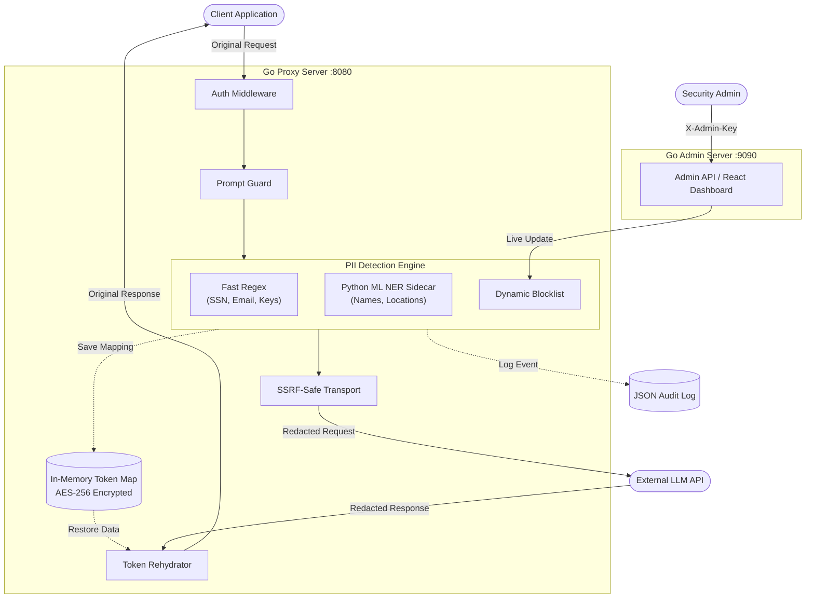
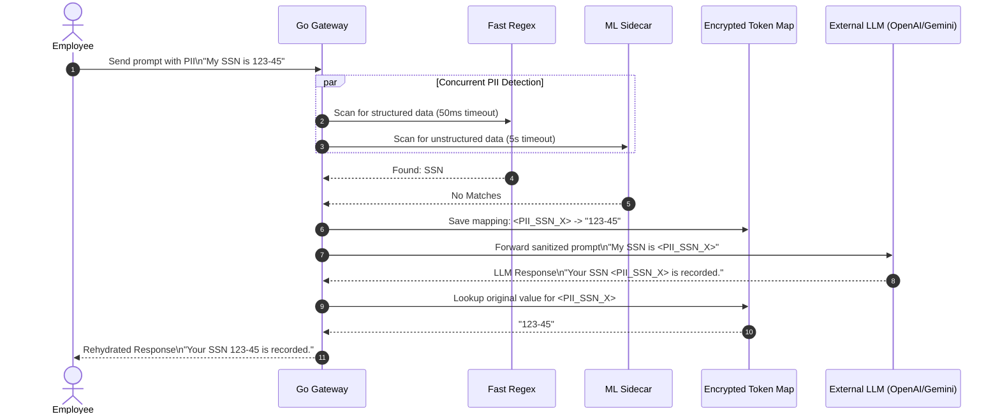
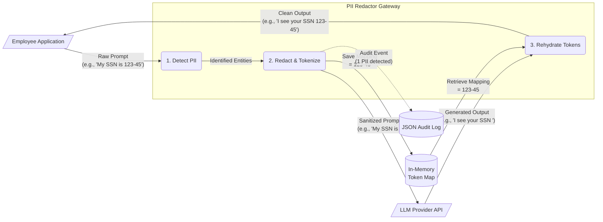

# PII Redactor Gateway

An enterprise-grade API gateway that sits between your corporate network and external LLM APIs, scrubbing Personally Identifiable Information (PII) from requests before they leave the perimeter.

## Features

- **PII Detection** — Regex patterns (email, SSN, credit card with Luhn validation, phone, IP, API keys), keyword blocklists, configurable confidence thresholds, and allowlists
- **HMAC-Signed Token Redaction** — Replaces PII with cryptographically signed tokens; prevents LLM injection attacks via constant-time HMAC verification
- **In-Memory PII Encryption** — AES-256-GCM encryption of PII values in the token map; heap dumps yield ciphertext
- **Streaming Support** — SSE overlap buffer to catch PII spanning chunk boundaries
- **Multi-Provider** — OpenAI, Anthropic, Azure OpenAI, and Google Gemini with per-provider auth and circuit breakers
- **Prompt Injection Defense** — 10+ regex patterns detecting instruction override, jailbreak, and system prompt extraction attempts
- **SSRF Prevention** — Egress firewall blocking private IP connections; domain allowlist from config
- **Multipart Upload Scanning** — PII detection in uploaded files (15 text formats + base64 decoding)
- **JWT Authentication** — Supports HMAC, RSA, and ECDSA verification with user ID context propagation
- **Structured Logging** — JSON-structured logs via `go.uber.org/zap` for SIEM/ELK ingestion
- **Audit Trail** — Per-request audit entries with correlation ID, user ID, PII count, latency
- **Hot-Reload Config** — Copy-on-write atomic config swaps via Viper fsnotify
- **Admin API** — Health/readiness probes, dynamic blocklist management, Prometheus metrics on separate port

## Quick Start

```bash
# Clone and build
git clone <repo-url> && cd pii-gateway
go build -o pii-gateway ./cmd/gateway/

# Set API keys as environment variables
export OPENAI_API_KEY="sk-..."
export ANTHROPIC_API_KEY="sk-ant-..."
export GEMINI_API_KEY="AIza..."

# Run
./pii-gateway --config config.yaml
```

The gateway starts two servers:
- **Proxy** on `:8080` — forward LLM requests here
- **Admin** on `127.0.0.1:9090` — health checks, metrics, blocklist management

## Usage

Send requests through the gateway using provider path prefixes:

### Bash / macOS / Linux

```bash
# OpenAI
curl http://localhost:8080/openai/v1/chat/completions \
  -H "Content-Type: application/json" \
  -H "Authorization: Bearer YOUR_OPENAI_KEY" \
  -d '{"model":"gpt-4","messages":[{"role":"user","content":"My SSN is 123-45-6789"}]}'

# Gemini
curl "http://localhost:8080/gemini/v1beta/models/gemini-2.5-flash:generateContent?key=YOUR_GEMINI_KEY" \
  -H "Content-Type: application/json" \
  -d '{"contents":[{"parts":[{"text":"Call me at 555-123-4567"}]}]}'
```

### Windows PowerShell

```powershell
# OpenAI
$body = @{
    model = "gpt-4"
    messages = @( @{ role = "user"; content = "My SSN is 123-45-6789" } )
} | ConvertTo-Json

Invoke-RestMethod -Uri "http://localhost:8080/openai/v1/chat/completions" `
  -Method Post `
  -Headers @{ "Content-Type" = "application/json"; "Authorization" = "Bearer YOUR_OPENAI_KEY" } `
  -Body $body

# Gemini
$body = @{
    contents = @( @{ parts = @( @{ text = "Call me at 555-123-4567" } ) } )
} | ConvertTo-Json -Depth 10

Invoke-RestMethod -Uri "http://localhost:8080/gemini/v1beta/models/gemini-2.5-flash:generateContent?key=YOUR_GEMINI_KEY" `
  -Method Post `
  -Headers @{ "Content-Type" = "application/json" } `
  -Body $body
```

PII is automatically detected, replaced with HMAC-signed tokens, and restored in the response.

## Configuration

See [config.yaml](config.yaml) for the full configuration reference. Key settings:

| Setting | Default | Description |
|---------|---------|-------------|
| `server.proxy_addr` | `:8080` | Proxy listener address |
| `server.admin_addr` | `127.0.0.1:9090` | Admin listener (loopback only) |
| `pii.confidence_threshold` | `0.8` | Minimum detection confidence |
| `pii.regex_timeout` | `50ms` | ReDoS guard per-pattern timeout |
| `pii.overlap_buffer_size` | `128` | SSE overlap buffer bytes |
| `auth.enabled` | `false` | Enable JWT/API key auth |
| `logging.level` | `info` | Log level (debug/info/warn/error) |
| `logging.format` | `json` | Log format (json/console) |

## Admin API

```bash
# Health check
curl http://localhost:9090/healthz

# Readiness probe
curl http://localhost:9090/readyz

# Manage blocklist
curl -H "X-Admin-Key: admin-secret-key" http://localhost:9090/admin/blocklist
curl -X POST -H "X-Admin-Key: admin-secret-key" \
  -d '{"terms":["CLASSIFIED"]}' http://localhost:9090/admin/blocklist

# Prometheus metrics
curl http://localhost:9090/metrics
```

## Architecture

### 1. System Architecture



### 2. Sequence Diagram (Token-Map Round Trip)



### 3. Data Flow Diagram (State Changes)




## Project Structure

```
cmd/gateway/          Entry point
internal/
  admin/              Admin API handlers
  audit/              Audit logger
  config/             Config loading with hot-reload
  middleware/         Auth, CORS, logging, metrics, prompt guard,
                      egress firewall, multipart scanner
  pii/                Detection pipeline, redactor, rehydrator,
                      token map with AES encryption
  provider/           LLM provider adapters (OpenAI, Anthropic,
                      Azure, Gemini)
  proxy/              Reverse proxy handler, SSE streaming
  server/             HTTP server wiring
  zaplog/             Structured logging
pkg/models/           Shared types
```

## Development

```bash
# Build
go build ./...

# Test
go test ./...

# Run with race detector
go run -race ./cmd/gateway/ --config config.yaml
```


Proprietary — Internal use only.
