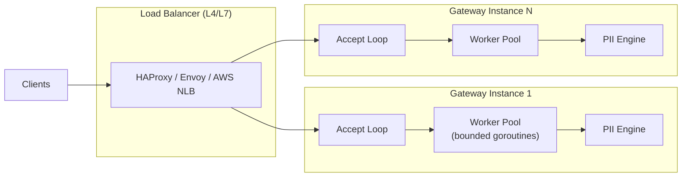
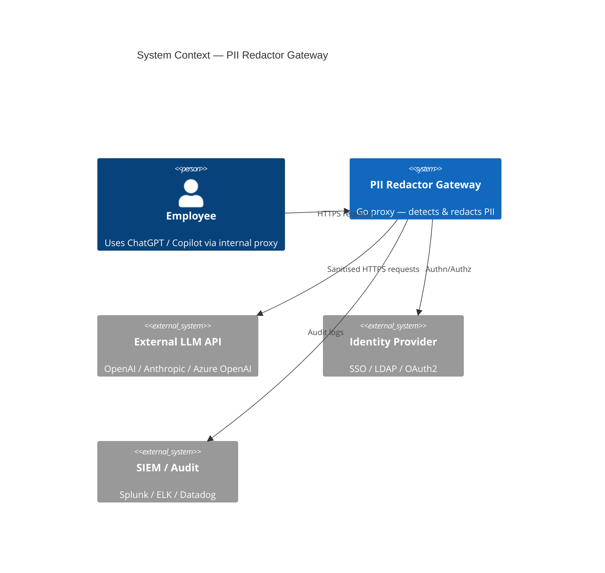
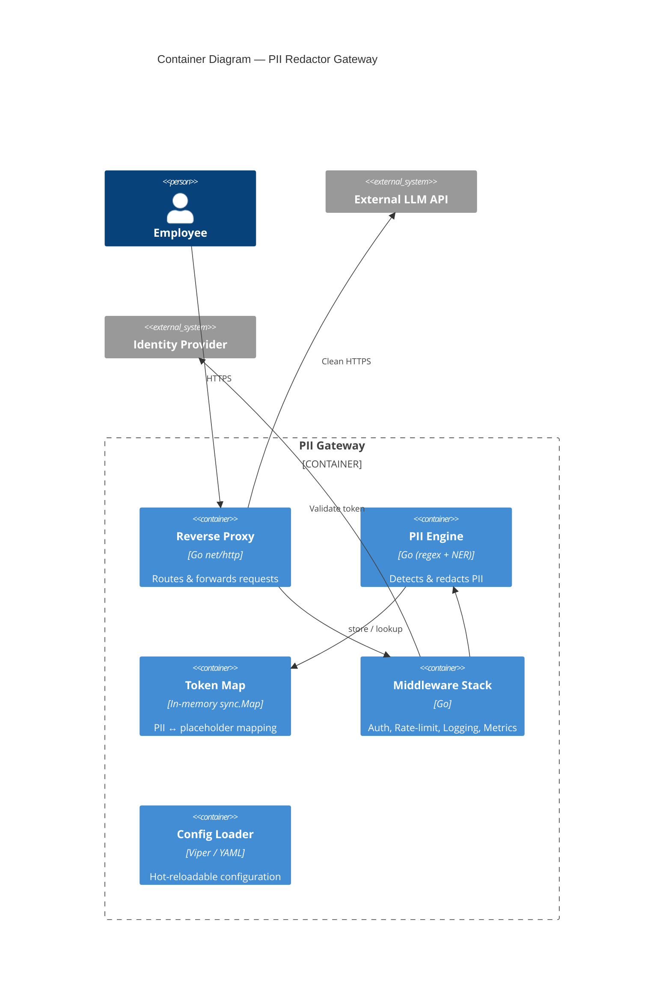
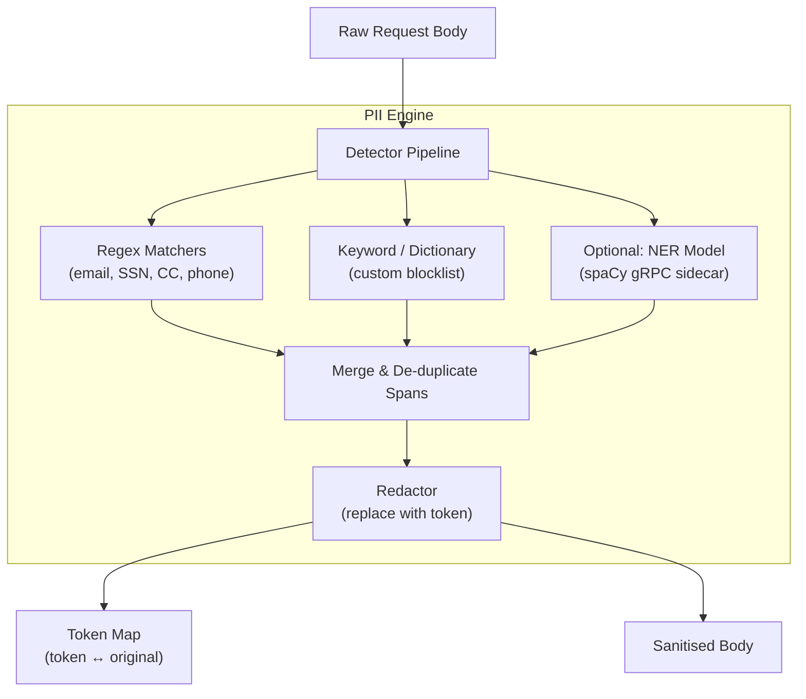
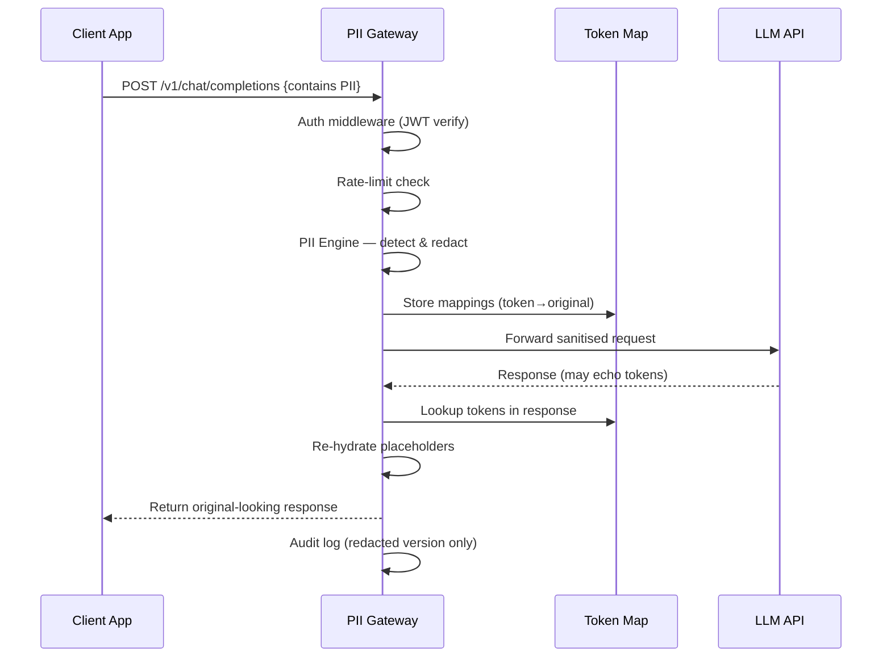

# Privacy-First API Gateway for LLMs — PII Redactor

An enterprise-grade local proxy server (Go) that sits between a company network and external LLM APIs (OpenAI, Anthropic, etc.), intercepting every request and scrubbing Personally Identifiable Information before it leaves the perimeter.

---

## 1 · System Design

### 1.1 Problem Statement

Enterprises want employees to leverage public LLMs **without** risking leakage of:
- **PII** — names, emails, phone numbers, SSNs, credit-card numbers, addresses
- **PHI** — health records (HIPAA)
- **Proprietary code / secrets** — API keys, internal URLs, DB connection strings

### 1.2 High-Level Data Flow

```
Employee App ──► PII Gateway ──► External LLM API
                   │                     │
            ┌──────┘                     │
            ▼                            ▼
   ┌──────────────┐           ┌──────────────────┐
   │ 1. Authenticate│          │ 4. Forward clean  │
   │ 2. Detect PII  │          │    request        │
   │ 3. Redact /    │          │ 5. Receive resp.  │
   │    tokenize    │          │ 6. Re-hydrate     │
   └──────────────┘           │    (optional)     │
                               └──────────────────┘
```

**Key insight — Token-Map round-trip:**
1. PII is replaced with **deterministic placeholder tokens** (`<PII_EMAIL_a3f2>`) before the request leaves the gateway.
2. The mapping `token → original value` is held **only in-memory** (or encrypted local store) for the lifespan of the request.
3. When the LLM response arrives, placeholders in the output are **re-hydrated** back to original values before returning to the employee.

### 1.3 Concurrent Design — Scaling to Millions of Users



| Concern | Design Decision |
|---|---|
| **Per-request goroutine** | Each accepted connection spawns a goroutine; Go scheduler multiplexes onto OS threads. |
| **Bounded worker pool** | A semaphore channel (`chan struct{}`) caps concurrent in‑flight requests (e.g. 10 000) to prevent OOM under spike. |
| **Back-pressure** | When the semaphore is full, new requests receive `HTTP 503 — Service Unavailable` immediately. |
| **I/O multiplexing** | `net/http` uses epoll/kqueue under the hood — no thread-per-connection overhead. |
| **Streaming support** | LLM SSE streams are proxied chunk-by-chunk using `io.Pipe` + `http.Flusher` so PII scanning happens per-chunk. |
| **Horizontal scaling** | Gateway is **stateless** (token map lives only for request lifetime) → trivially scale behind an L4 load balancer. |
| **Graceful shutdown** | `os/signal` + `context.Context` drains in-flight requests before terminating. |

#### Memory & GC tuning (production)
- `GOGC=200` or `GOMEMLIMIT` to reduce GC frequency under steady load.
- Object pooling via `sync.Pool` for request/response buffers.

---

## 2 · Architecture Diagrams

### 2.1 C4 — System Context



### 2.2 C4 — Container Diagram



### 2.3 Component — PII Engine Detail



### 2.4 Request ↔ Response Data Flow



---

## 3 · Project Structure

```
c:\Program1\sysMon\
├── go.mod
├── go.sum
├── Makefile                       # build, test, lint, docker
├── config.yaml                    # default configuration
├── Dockerfile
│
├── cmd/
│   └── gateway/
│       └── main.go                # entry-point — boots server
│
├── internal/
│   ├── config/
│   │   └── config.go              # Viper-based config loader
│   │
│   ├── server/
│   │   └── server.go              # HTTP server setup, graceful shutdown
│   │
│   ├── proxy/
│   │   ├── handler.go             # reverse-proxy handler (httputil.ReverseProxy)
│   │   └── handler_test.go
│   │
│   ├── middleware/
│   │   ├── auth.go                # JWT / API-key authentication
│   │   ├── ratelimit.go           # token-bucket rate limiter
│   │   ├── logging.go             # structured request/response logging
│   │   ├── metrics.go             # Prometheus metrics
│   │   └── recovery.go            # panic recovery
│   │
│   ├── pii/
│   │   ├── detector.go            # PII detection interface + pipeline
│   │   ├── detector_test.go
│   │   ├── regex.go               # regex-based matchers
│   │   ├── regex_test.go
│   │   ├── blocklist.go           # keyword / custom-term blocklist
│   │   ├── redactor.go            # replaces PII spans with tokens
│   │   ├── redactor_test.go
│   │   ├── rehydrator.go          # restores tokens → originals in response
│   │   └── tokenmap.go            # thread-safe token ↔ original mapping
│   │
│   └── audit/
│       ├── logger.go              # audit-trail writer (file / SIEM)
│       └── logger_test.go
│
├── pkg/
│   └── models/
│       └── types.go               # shared request/response DTOs
│
└── test/
    └── integration/
        └── proxy_integration_test.go
```

> **Why `internal/`?** Go's `internal` package boundary ensures PII engine internals can never be imported by external consumers — defense-in-depth.

---

## 4 · External Dependencies

### 4.1 Go Modules

| Package | Purpose | Why this one? |
|---|---|---|
| `net/http` (stdlib) | HTTP server & reverse proxy | Zero-alloc, production-proven |
| `net/http/httputil` (stdlib) | `ReverseProxy` struct | Built-in buffered proxy with director hook |
| `github.com/spf13/viper` | Configuration management | YAML/ENV/flags, hot-reload via `fsnotify` |
| `github.com/gorilla/mux` | HTTP router | Path params, middleware chaining (or stdlib `http.ServeMux` in Go 1.22+) |
| `go.uber.org/zap` | Structured logging | High-performance, zero-alloc JSON logger |
| `github.com/prometheus/client_golang` | Metrics export | Industry-standard Prometheus exposition |
| `github.com/golang-jwt/jwt/v5` | JWT parsing & validation | Maintained, supports RS256/ES256 |
| `golang.org/x/time/rate` | Rate limiter | Stdlib-adjacent token-bucket implementation |
| `github.com/dlclark/regexp2` | .NET-compatible regex | Look-ahead/behind for complex PII patterns |
| `github.com/stretchr/testify` | Test assertions | Fluent `assert` / `require` helpers |

### 4.2 Optional / Advanced

| Package / Tool | Purpose |
|---|---|
| `github.com/grpc/grpc-go` | gRPC client to call a Python NER sidecar (spaCy / Presidio) for ML-based PII detection |
| `github.com/redis/go-redis/v9` | Distributed rate-limiting counters (multi-instance) |
| `go.opentelemetry.io/otel` | Distributed tracing (Jaeger / Tempo) |
| `github.com/hashicorp/vault/api` | Secrets management for LLM API keys |

### 4.3 Infrastructure Stack

| Component | Options |
|---|---|
| **Container runtime** | Docker / Podman |
| **Orchestrator** | Kubernetes (Deployment + HPA) |
| **Load balancer** | Envoy / HAProxy / AWS NLB |
| **Secrets** | HashiCorp Vault / AWS Secrets Manager |
| **Monitoring** | Prometheus + Grafana |
| **Logging** | ELK Stack / Loki |
| **CI/CD** | GitHub Actions / GitLab CI |
| **TLS termination** | Envoy sidecar or ingress controller |

---

## 5 · Key Design Decisions

| # | Decision | Rationale |
|---|---|---|
| 1 | **In-memory token map, not persisted** | PII never touches disk; map is GC'd after response completes. |
| 2 | **Regex-first, NER-optional** | Regex covers 90 %+ of structured PII at near-zero latency; NER sidecar is opt-in for unstructured text. |
| 3 | **Middleware chain pattern** | Each concern (auth, rate-limit, PII, logging) is a composable `http.Handler` wrapper — easy to add/remove. |
| 4 | **Streaming-aware proxy** | SSE / chunked responses are scanned per-chunk so users see real-time output without buffering entire response. |
| 5 | **Stateless gateway** | No shared state between instances → linear horizontal scale. |
| 6 | **`internal/` package layout** | Prevents external import of PII internals; enforced by Go compiler. |

---

## 6 · Verification Plan

### Automated Tests

| Test | Command | What it validates |
|---|---|---|
| PII regex unit tests | `go test ./internal/pii/ -v -run TestRegex` | All regex patterns correctly match/reject PII samples |
| Redactor round-trip tests | `go test ./internal/pii/ -v -run TestRedact` | Redact → re-hydrate produces original text |
| Token map concurrency tests | `go test ./internal/pii/ -v -race -run TestTokenMap` | Thread-safety under concurrent goroutine access |
| Proxy handler tests | `go test ./internal/proxy/ -v` | Correct request forwarding, header proxying |
| Integration test (end-to-end) | `go test ./test/integration/ -v -tags=integration` | Full flow with a mock LLM HTTP server |
| All tests + race detector | `go test -race ./...` | No data races anywhere |

### Manual Verification
1. **Start gateway**: `go run ./cmd/gateway/ --config config.yaml`
2. **Send a test curl** with PII embedded:
   ```bash
   curl -X POST http://localhost:8080/v1/chat/completions \
     -H "Authorization: Bearer <test-token>" \
     -H "Content-Type: application/json" \
     -d '{"messages":[{"role":"user","content":"My SSN is 123-45-6789 and email is john@acme.com"}]}'
   ```
3. **Inspect gateway logs** — confirm PII is replaced with `<PII_*>` tokens before forwarding.
4. **Check response** — confirm tokens are re-hydrated back in the response returned to the client.

> [!IMPORTANT]
> This plan covers architecture and design only. Implementation will begin after user approval!
