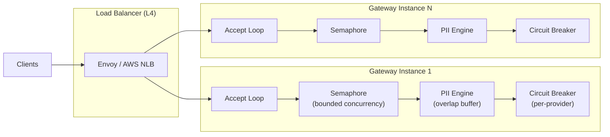
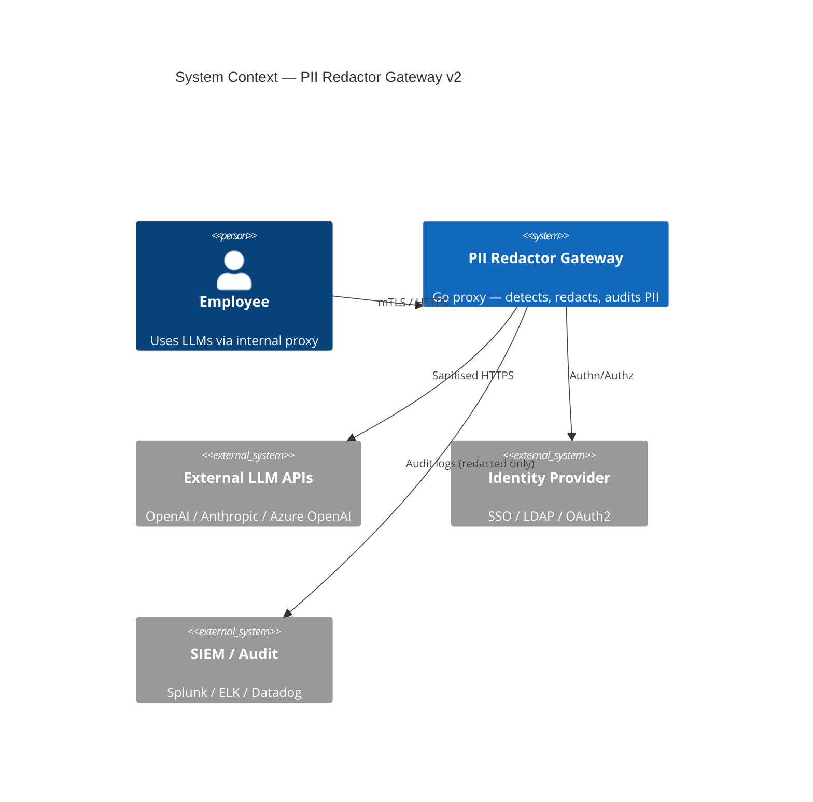
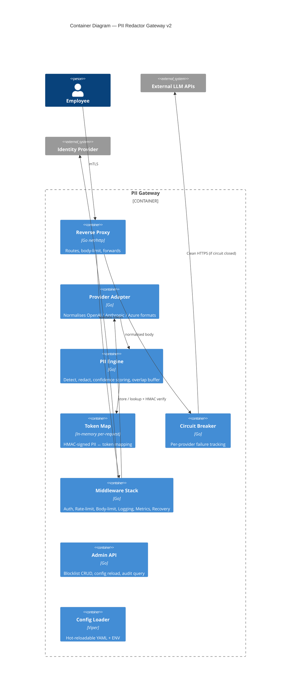
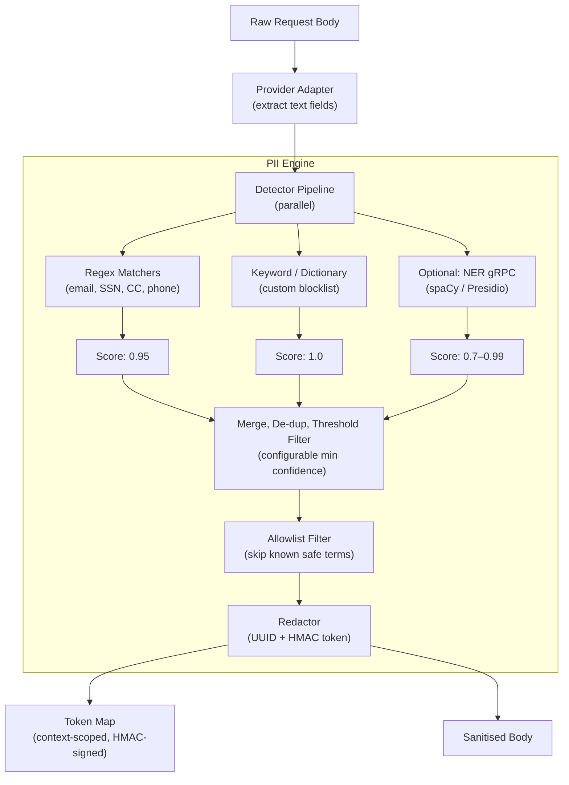
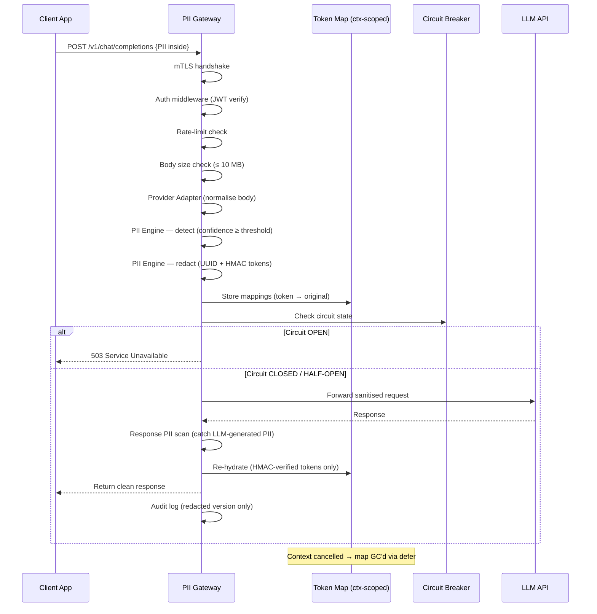
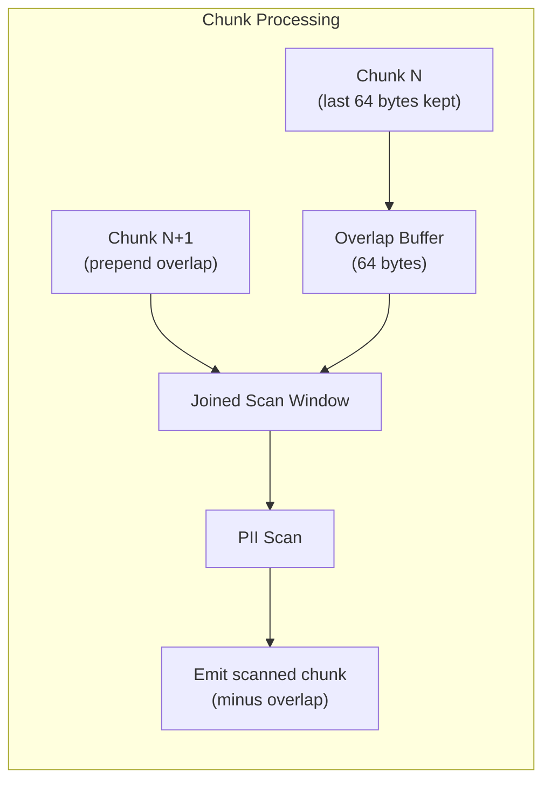

# Privacy-First API Gateway for LLMs — PII Redactor (v2 — Revised)

An enterprise-grade local proxy server (Go) that sits between a company network and external LLM APIs (OpenAI, Anthropic, etc.), intercepting every request and scrubbing PII before it leaves the perimeter.

---

## 0 · Self-Critique of v1 Plan

> [!CAUTION]
> The following **12 flaws** were found in v1 and are addressed in this revision.

| # | Flaw | Severity | Fix in v2 |
|---|---|---|---|
| 1 | **Token-injection attack in re-hydration** — LLM could generate text matching the `<PII_*>` pattern, causing real PII to be injected into responses the user never sent | 🔴 Critical | Use cryptographically random UUIDs as tokens (`__PII_ab12cd34ef56__`) + HMAC signature so only genuine tokens pass validation |
| 2 | **Streaming chunk-boundary PII split** — An SSN like `123-45-6789` can arrive as `"123-45"` in chunk 1 and `"-6789"` in chunk 2; per-chunk scanning misses it | 🔴 Critical | Add a sliding-window overlap buffer that retains the last N bytes across chunk boundaries |
| 3 | **No response-side PII scanning** — LLM might *generate* new PII from its training data (not just echo tokens); v1 only re-hydrated tokens | 🟠 High | Add a response PII scan step *before* re-hydration; redact any new PII the LLM generates |
| 4 | **No request body size limit** — Absent max-body enforcement allows a single request to OOM the gateway | 🟠 High | Add configurable `MaxRequestBodyBytes` middleware (default 10 MB) |
| 5 | **Token map leak on failure paths** — If client disconnects or LLM times out, the in-memory token map is never cleaned up | 🟠 High | Tie token map lifetime to `context.Context`; use `defer` cleanup + context cancellation |
| 6 | **`gorilla/mux` is archived** — Repository was archived Dec 2022; no longer maintained | 🟡 Medium | Switch to `github.com/go-chi/chi/v5` (actively maintained, lightweight, idiomatic middleware) |
| 7 | **No multi-provider API format handling** — OpenAI, Anthropic, and Azure use different request/response JSON shapes; a single proxy handler can't find PII fields generically | 🟡 Medium | Add a **Provider Adapter** layer that normalises request/response bodies per-provider before PII scanning |
| 8 | **No file/multipart upload scanning** — Employees may upload files containing PII (`.csv`, `.pdf` as base64) via multipart requests | 🟡 Medium | Add multipart body parser; scan decoded file content; reject or redact |
| 9 | **No circuit breaker for LLM outages** — If the LLM is down, requests pile up consuming goroutines until OOM | 🟡 Medium | Add circuit breaker pattern (closed → open → half-open) for each upstream provider |
| 10 | **No admin API / dashboard** — No way to update blocklists, view audit logs, or check health without SSH + restart | 🟡 Medium | Add `/admin/` routes (blocklist CRUD, config reload, audit log query) behind separate auth |
| 11 | **Regex false-positives not handled** — `"Jordan"` matches name regex but could be a country; no confidence scoring | 🟡 Medium | Add per-detector confidence scores + configurable threshold; allow allowlists |
| 12 | **Missing mTLS for internal traffic** — Employees connect over plain HTTP inside the corporate network; a compromised hop can sniff PII | 🟡 Medium | Support mTLS between client ↔ gateway using configurable cert paths |

---

## 1 · System Design (Revised)

### 1.1 Problem Statement

Enterprises want employees to leverage public LLMs **without** risking leakage of:
- **PII** — names, emails, phone numbers, SSNs, credit-card numbers, addresses
- **PHI** — health records (HIPAA)
- **Proprietary code / secrets** — API keys, internal URLs, DB connection strings

### 1.2 Revised Data Flow

```
Employee App ──(mTLS)──► PII Gateway ──(HTTPS)──► External LLM API
                              │
         ┌────────────────────┼────────────────────┐
         ▼                    ▼                    ▼
   ┌───────────┐     ┌───────────────┐     ┌────────────┐
   │ Inbound   │     │  Outbound     │     │  Response   │
   │ Pipeline  │     │  Pipeline     │     │  Pipeline   │
   │           │     │               │     │             │
   │ 1. mTLS   │     │ 5. Provider   │     │ 8. Response │
   │ 2. Auth   │     │    Adapter    │     │    PII scan │
   │ 3. Rate   │     │ 6. Forward    │     │ 9. Re-hydrate│
   │    limit  │     │    clean req  │     │    (HMAC-   │
   │ 4. Body   │     │ 7. Circuit    │     │    verified)│
   │    size   │     │    breaker    │     │10. Audit log│
   │    limit  │     │               │     │             │
   │ 4b.PII    │     └───────────────┘     └────────────┘
   │   detect  │
   │   + redact│
   └───────────┘
```

### 1.3 Secure Token-Map Design (v2)

```
Original:  "My email is john@acme.com"
Token:     "My email is __PII_7f3a_HMAC_c9e2b4__"
                         ├─ UUID ─┤├── HMAC ──┤
```

- **UUID portion** — `crypto/rand` generated, collision-resistant
- **HMAC portion** — `HMAC-SHA256(uuid, per-request-secret)`, validated before any re-hydration
- **Benefit** — Even if the LLM outputs `__PII_7f3a__`, the HMAC won't match → no injection

### 1.4 Concurrent Design — Scaling to Millions of Users



| Concern | Design Decision |
|---|---|
| **Per-request goroutine** | Each connection spawns a goroutine; Go scheduler multiplexes onto OS threads |
| **Bounded concurrency** | Semaphore channel (`chan struct{}`) caps in-flight requests (default 10 000) |
| **Back-pressure** | Semaphore full → `HTTP 503` immediately; no queuing |
| **Body size limit** | `http.MaxBytesReader` wraps body (default 10 MB); prevents OOM |
| **Circuit breaker** | Per-provider breaker (closed → open after 5 failures → half-open after 30s) |
| **Streaming overlap buffer** | Retains last 64 bytes across SSE chunks to catch PII spanning boundaries |
| **Context-scoped token map** | Token map is allocated per-request, tied to `context.Context`, cleaned up via `defer` |
| **Graceful shutdown** | `os/signal` + `context.Context` drains in-flight requests |
| **Horizontal scaling** | Fully stateless → linear scale behind L4 load balancer |

#### Memory & GC Tuning
- `GOMEMLIMIT` to bound heap; `sync.Pool` for request/response buffers
- Overlap buffers are pooled, not allocated per-chunk

---

## 2 · Architecture Diagrams

### 2.1 C4 — System Context



### 2.2 C4 — Container Diagram



### 2.3 Component — PII Engine Detail (Revised)



### 2.4 Request ↔ Response Flow (Revised)



### 2.5 Streaming Overlap Buffer



> This ensures PII patterns like SSNs or phone numbers that fall on a chunk boundary are still detected.

---

## 3 · Project Structure (Revised)

```
c:\Program1\sysMon\
├── go.mod
├── go.sum
├── Makefile                       # build, test, lint, docker
├── config.yaml                    # default configuration
├── Dockerfile
├── README.md
│
├── cmd/
│   └── gateway/
│       └── main.go                # entry-point — boots server
│
├── internal/
│   ├── config/
│   │   └── config.go              # Viper-based config loader + hot-reload
│   │
│   ├── server/
│   │   └── server.go              # HTTP server setup, mTLS, graceful shutdown
│   │
│   ├── proxy/
│   │   ├── handler.go             # reverse-proxy handler (httputil.ReverseProxy)
│   │   ├── handler_test.go
│   │   └── streaming.go           # SSE/chunked proxy with overlap buffer
│   │
│   ├── provider/
│   │   ├── adapter.go             # Provider interface + registry
│   │   ├── openai.go              # OpenAI request/response format normaliser
│   │   ├── anthropic.go           # Anthropic format normaliser
│   │   └── azure.go               # Azure OpenAI format normaliser
│   │
│   ├── middleware/
│   │   ├── auth.go                # JWT / API-key authentication
│   │   ├── ratelimit.go           # token-bucket rate limiter
│   │   ├── bodylimit.go           # max request body size enforcement
│   │   ├── logging.go             # structured request/response logging
│   │   ├── metrics.go             # Prometheus metrics
│   │   ├── recovery.go            # panic recovery
│   │   └── circuitbreaker.go      # per-provider circuit breaker
│   │
│   ├── pii/
│   │   ├── detector.go            # Detector interface + pipeline orchestrator
│   │   ├── detector_test.go
│   │   ├── regex.go               # regex-based matchers (email, SSN, CC, phone)
│   │   ├── regex_test.go
│   │   ├── blocklist.go           # keyword / custom-term blocklist
│   │   ├── allowlist.go           # safe-term allowlist (skip known false positives)
│   │   ├── confidence.go          # per-match confidence scoring + threshold
│   │   ├── redactor.go            # replaces PII spans with UUID+HMAC tokens
│   │   ├── redactor_test.go
│   │   ├── rehydrator.go          # HMAC-verified token → original restoration
│   │   ├── rehydrator_test.go
│   │   ├── tokenmap.go            # context-scoped thread-safe token map
│   │   ├── tokenmap_test.go
│   │   └── overlap.go             # streaming overlap buffer for chunk boundaries
│   │
│   ├── admin/
│   │   ├── handler.go             # admin API routes (blocklist CRUD, config reload)
│   │   └── handler_test.go
│   │
│   └── audit/
│       ├── logger.go              # audit-trail writer (file / SIEM sink)
│       └── logger_test.go
│
├── pkg/
│   └── models/
│       └── types.go               # shared request/response DTOs
│
└── test/
    ├── integration/
    │   └── proxy_integration_test.go
    └── testdata/
        ├── pii_samples.json       # test cases for PII detection
        └── config_test.yaml       # test configuration
```

**New in v2:** `provider/` adapter layer, `admin/` handler, `overlap.go`, `allowlist.go`, `confidence.go`, `bodylimit.go`, `circuitbreaker.go`, `rehydrator_test.go`, `tokenmap_test.go`, `testdata/`.

---

## 4 · External Dependencies (Revised)

### 4.1 Go Modules

| Package | Purpose | Why this one? |
|---|---|---|
| `net/http` (stdlib) | HTTP server & reverse proxy | Production-proven, zero external dep |
| `net/http/httputil` (stdlib) | `ReverseProxy` struct | Built-in director hook for request rewriting |
| `crypto/hmac`, `crypto/rand` (stdlib) | HMAC token signing + UUID generation | Secure token-injection prevention |
| `github.com/go-chi/chi/v5` | HTTP router | Actively maintained (replaces archived `gorilla/mux`), idiomatic middleware |
| `github.com/spf13/viper` | Configuration management | YAML/ENV/flags + hot-reload via `fsnotify` |
| `go.uber.org/zap` | Structured logging | High-perf zero-alloc JSON logger |
| `github.com/prometheus/client_golang` | Metrics export | Industry-standard Prometheus exposition |
| `github.com/golang-jwt/jwt/v5` | JWT parsing & validation | Maintained, RS256/ES256 |
| `golang.org/x/time/rate` | Rate limiter | Stdlib-adjacent token-bucket impl |
| `github.com/dlclark/regexp2` | .NET-compatible regex | Look-ahead/behind for complex PII patterns |
| `github.com/sony/gobreaker` | Circuit breaker | Battle-tested, implements closed→open→half-open |
| `github.com/stretchr/testify` | Test assertions | Fluent `assert` / `require` helpers |

### 4.2 Optional / Advanced

| Package / Tool | Purpose |
|---|---|
| `github.com/grpc/grpc-go` | gRPC client for Python NER sidecar (spaCy / Presidio) |
| `github.com/redis/go-redis/v9` | Distributed rate-limiting counters (multi-instance) |
| `go.opentelemetry.io/otel` | Distributed tracing (Jaeger / Tempo) |
| `github.com/hashicorp/vault/api` | Secrets management for LLM API keys |

### 4.3 Infrastructure Stack

| Component | Options |
|---|---|
| **Container runtime** | Docker / Podman |
| **Orchestrator** | Kubernetes (Deployment + HPA based on in-flight requests) |
| **Load balancer** | Envoy / AWS NLB (L4, sticky sessions not needed) |
| **Secrets** | HashiCorp Vault / AWS Secrets Manager |
| **Monitoring** | Prometheus + Grafana |
| **Logging** | ELK Stack / Loki |
| **CI/CD** | GitHub Actions / GitLab CI |
| **TLS** | mTLS (client ↔ gateway), TLS (gateway ↔ LLM); certs via Vault PKI or cert-manager |

---

## 5 · Key Design Decisions (Revised)

| # | Decision | Rationale |
|---|---|---|
| 1 | **HMAC-signed tokens** | Prevents token-injection attacks; LLM can't forge valid tokens |
| 2 | **Context-scoped token map** | Tied to request lifetime; auto-cleanup on timeout/cancel via `defer` |
| 3 | **Streaming overlap buffer (64 B)** | Catches PII spanning chunk boundaries with minimal memory overhead |
| 4 | **Response PII scan** | LLM may generate new PII from training data; must scan outbound too |
| 5 | **Provider adapter pattern** | Decouples PII engine from vendor-specific JSON formats; easy to add new providers |
| 6 | **Confidence scoring + allowlist** | Reduces false positives; configurable threshold per PII type |
| 7 | **Circuit breaker per provider** | Prevents cascading failures when upstream is degraded |
| 8 | **Body size limit middleware** | Prevents single-request OOM; configurable per-route |
| 9 | **`chi` router over `gorilla/mux`** | Actively maintained; gorilla/mux archived since 2022 |
| 10 | **mTLS support** | Defense-in-depth; PII encrypted in transit even inside corporate network |
| 11 | **Admin API (separate auth)** | Hot-reload blocklists and config without restarting the gateway |
| 12 | **`internal/` package boundary** | Go compiler enforces no external import of PII engine internals |

---

## 6 · Verification Plan (Revised)

### Automated Tests

| Test | Command | What it validates |
|---|---|---|
| PII regex unit tests | `go test ./internal/pii/ -v -run TestRegex` | Patterns match/reject PII samples |
| Confidence scoring tests | `go test ./internal/pii/ -v -run TestConfidence` | Threshold filtering works correctly |
| Allowlist tests | `go test ./internal/pii/ -v -run TestAllowlist` | Known-safe terms are not redacted |
| Redactor round-trip (HMAC) | `go test ./internal/pii/ -v -run TestRedactRehydrate` | Redact → HMAC verify → re-hydrate = original |
| Token injection attack test | `go test ./internal/pii/ -v -run TestTokenInjection` | Forged tokens are rejected by HMAC |
| Token map context cleanup | `go test ./internal/pii/ -v -run TestTokenMapCleanup` | Map is GC'd when context is cancelled |
| Overlap buffer boundary test | `go test ./internal/pii/ -v -run TestOverlapBuffer` | PII split across chunks is detected |
| Circuit breaker test | `go test ./internal/middleware/ -v -run TestCircuitBreaker` | Opens after N failures, half-opens after timeout |
| Provider adapter tests | `go test ./internal/provider/ -v` | OpenAI / Anthropic / Azure formats normalised |
| Race detector (all) | `go test -race ./...` | No data races |
| Integration (end-to-end) | `go test ./test/integration/ -v -tags=integration` | Full flow with mock LLM server |

### Manual Verification
1. Start gateway with mTLS: `go run ./cmd/gateway/ --config config.yaml`
2. Send curl with PII, verify redaction in logs + clean forwarding
3. Simulate LLM generating PII in response → verify response-side scan blocks it
4. Simulate chunk-split SSN → verify overlap buffer catches it
5. Kill mock LLM → verify circuit breaker opens → 503 returned
6. Hit admin API → verify blocklist CRUD and config hot-reload

> [!IMPORTANT]
> This plan covers architecture and design only. Implementation begins after approval.
