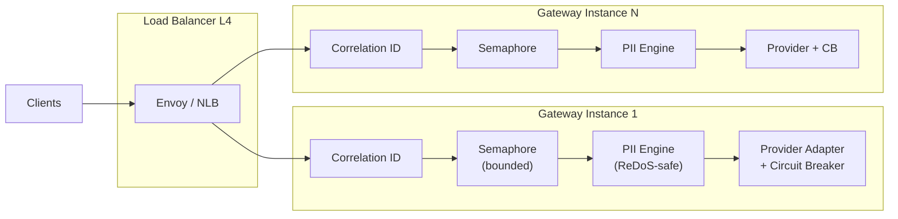
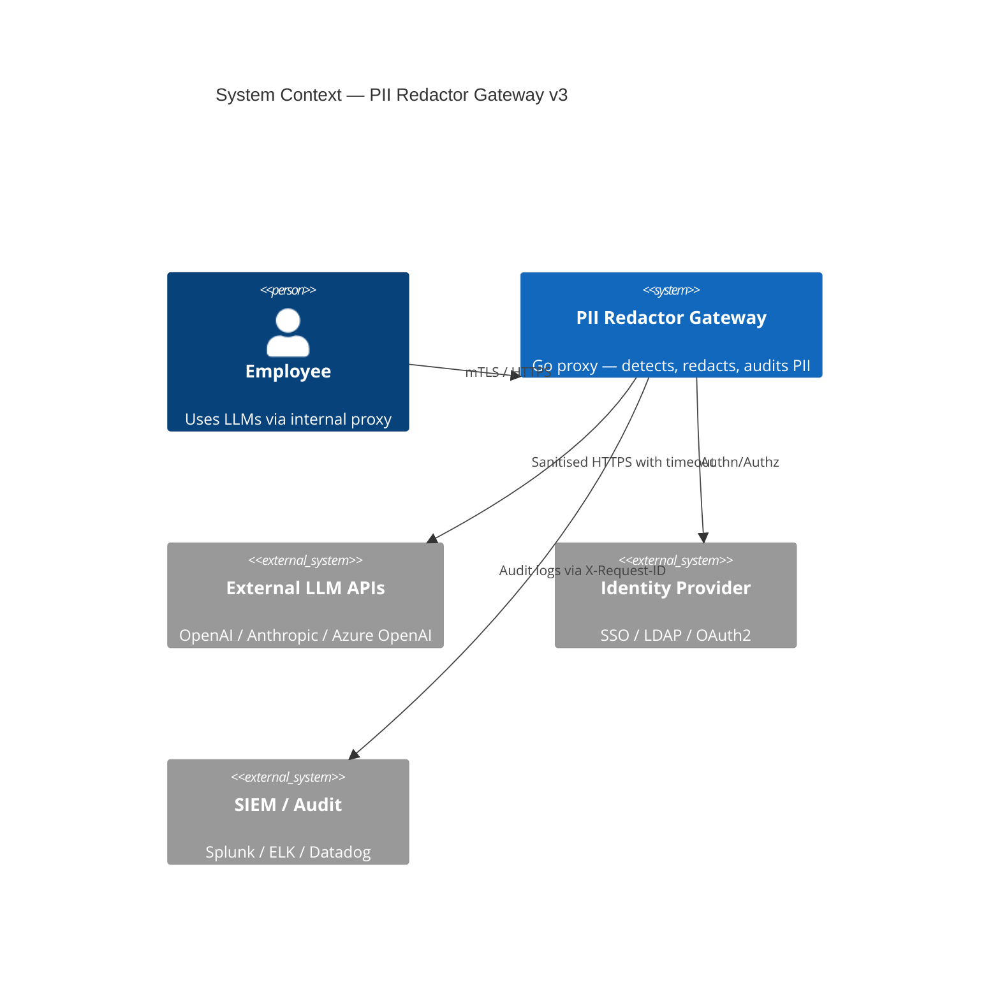
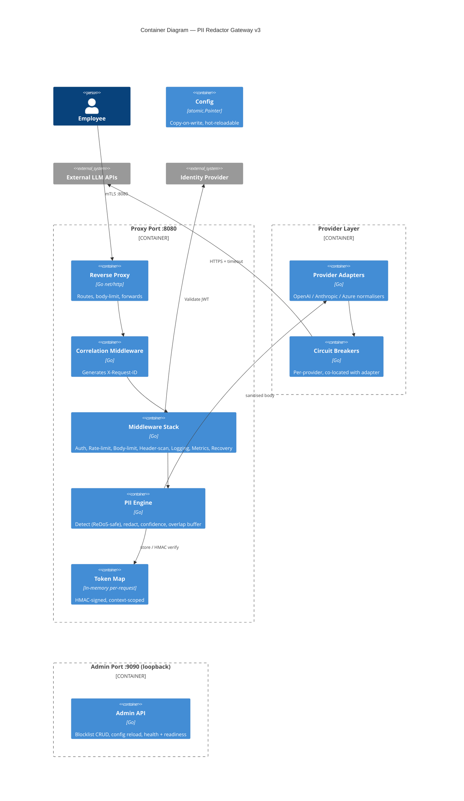
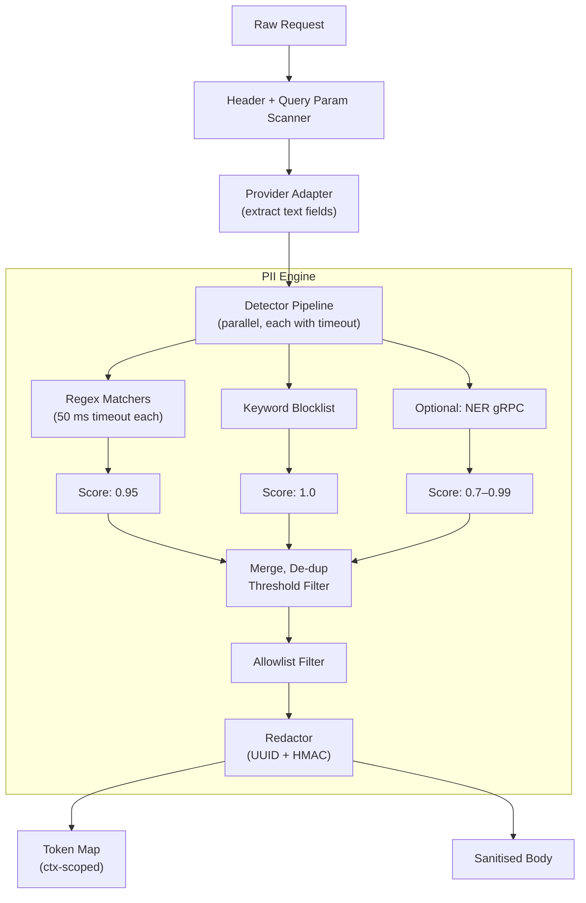
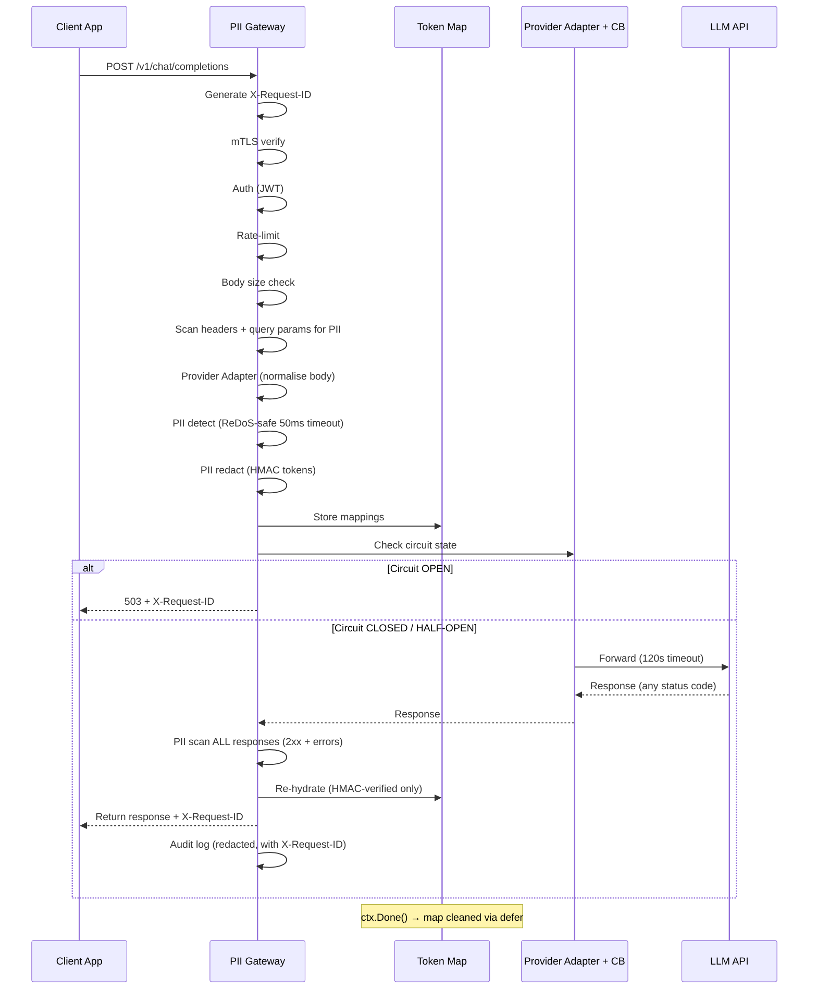
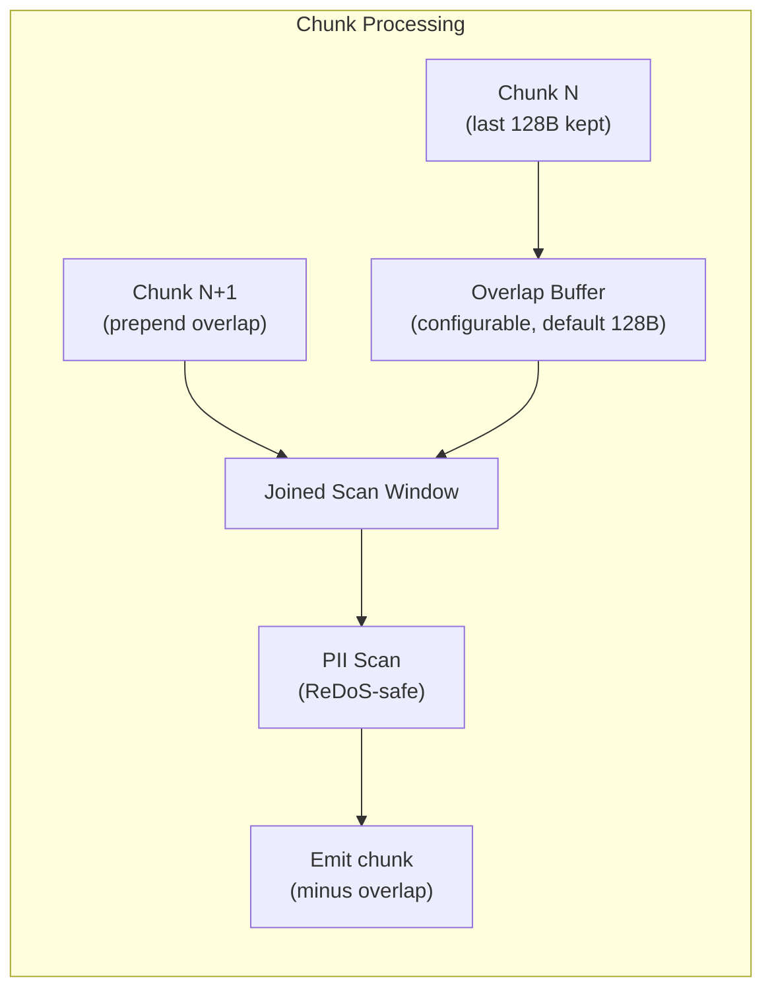
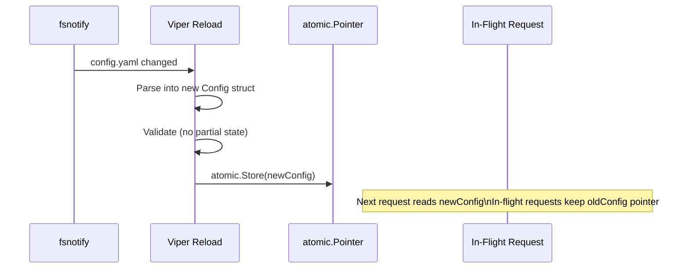

# Privacy-First API Gateway for LLMs — PII Redactor (v3 — Hardened)

An enterprise-grade local proxy server (Go) that sits between a company network and external LLM APIs (OpenAI, Anthropic, etc.), intercepting every request and scrubbing PII before it leaves the perimeter.

---

## 0 · Self-Critique History

### 0.1 v1 → v2 Flaws (12 found, all fixed)

| # | Flaw | Severity | Status |
|---|---|---|---|
| 1 | Token-injection attack in re-hydration | 🔴 Critical | ✅ HMAC-signed tokens |
| 2 | Streaming chunk-boundary PII split | 🔴 Critical | ✅ Overlap buffer |
| 3 | No response-side PII scanning | 🟠 High | ✅ Response PII scan step |
| 4 | No request body size limit | 🟠 High | ✅ `MaxBytesReader` middleware |
| 5 | Token map leak on failure paths | 🟠 High | ✅ Context-scoped map + `defer` |
| 6 | `gorilla/mux` archived | 🟡 Medium | ✅ Switched to `chi/v5` |
| 7 | No multi-provider handling | 🟡 Medium | ✅ Provider Adapter layer |
| 8 | No multipart upload scanning | 🟡 Medium | ✅ Multipart parser |
| 9 | No circuit breaker | 🟡 Medium | ✅ `gobreaker` |
| 10 | No admin API | 🟡 Medium | ✅ Admin routes |
| 11 | Regex false positives | 🟡 Medium | ✅ Confidence scoring + allowlist |
| 12 | No mTLS | 🟡 Medium | ✅ Configurable mTLS |

### 0.2 v2 → v3 Flaws (11 new, addressed below)

> [!CAUTION]
> Second-pass critique — deeper analysis from **security**, **performance**, **operational**, **correctness**, and **architecture** angles.

| # | Flaw | Category | Severity | Fix in v3 |
|---|---|---|---|---|
| 13 | **ReDoS (Regular Expression Denial of Service)** — Complex PII regex patterns (especially with `regexp2` look-ahead/behind) can cause catastrophic backtracking; a crafted input can hang a goroutine | Security | 🔴 Critical | Per-regex execution **timeout** (`regexp2.SetTimeout`); if match exceeds 50 ms, skip that detector for the input and log a warning |
| 14 | **PII leak via HTTP headers & query params** — v2 only scans request body; headers like `X-User-Email`, `Authorization` bearer tokens, or query params `?user=john@acme.com` can leak PII | Security | 🟠 High | Add header + query param scanning middleware; configurable list of headers to scrub |
| 15 | **Admin API on same port as proxy** — attacker who compromises an employee JWT could probe admin routes; single-port mixes trust zones | Security | 🟠 High | Serve admin API on a **separate port** (e.g. `:9090`) bound to `127.0.0.1` or internal VPC only |
| 16 | **LLM error responses not PII-scanned** — LLM APIs sometimes echo request content in error messages (e.g. `"invalid JSON: ... SSN 123-45-6789"`); v2 only scans success responses | Security | 🟠 High | Scan **all** LLM responses (2xx and non-2xx) through the response PII pipeline |
| 17 | **Overlap buffer is hardcoded 64 bytes — not configurable** — An email like `very.long.username@subdomain.example.co.uk` is 46 chars; an address can be much longer; 64 bytes may not be enough | Correctness | 🟡 Medium | Make overlap size **configurable** (default 128 bytes); document max PII pattern length per type |
| 18 | **No upstream request timeout** — If the LLM hangs (not down, just slow), goroutine + token map are held indefinitely; circuit breaker fires on failures, not on hangs | Performance | 🟠 High | Add configurable upstream **timeout** via `http.Client.Timeout` (default 120s); context deadline propagation |
| 19 | **No health / readiness probes** — Kubernetes can't determine if the gateway is ready to accept traffic or needs restart | Operational | 🟡 Medium | Add `/healthz` (liveness) and `/readyz` (readiness = upstream reachable + config loaded) endpoints |
| 20 | **Config hot-reload race condition** — If Viper reloads config mid-request, an in-flight request may read a partially-updated config (e.g. blocklist half-loaded) | Correctness | 🟡 Medium | **Copy-on-write** config: reload builds a new immutable config struct, then atomically swaps via `atomic.Pointer[Config]` |
| 21 | **No request correlation ID** — Can't trace a single request across gateway logs, LLM logs, and audit trail in production | Operational | 🟡 Medium | Generate `X-Request-ID` (UUID) in middleware; propagate to upstream `X-Request-ID` header; include in all log lines |
| 22 | **Circuit breaker misplaced in `middleware/`** — v2 puts it in the middleware stack, but it's intrinsically tied to a specific upstream provider, not to the generic middleware chain | Architecture | 🟡 Medium | Move to `internal/provider/circuitbreaker.go`; each provider adapter wraps its own breaker |
| 23 | **No load / benchmark tests** — Plan claims "millions of users" scalability but has no performance test to validate | Verification | 🟡 Medium | Add `test/benchmark/` with `go test -bench` micro-benchmarks + a `k6` / `vegeta` load test script |

---

## 1 · System Design (v3)

### 1.1 Problem Statement

Enterprises want employees to leverage public LLMs **without** risking leakage of:
- **PII** — names, emails, phone numbers, SSNs, credit-card numbers, addresses
- **PHI** — health records (HIPAA)
- **Proprietary code / secrets** — API keys, internal URLs, DB connection strings

### 1.2 Data Flow (v3)

```
Employee App ──(mTLS)──► PII Gateway ──(HTTPS + timeout)──► LLM API
                              │
       ┌──────────────────────┼──────────────────────────┐
       ▼                      ▼                          ▼
 ┌────────────┐       ┌──────────────┐          ┌──────────────┐
 │  Inbound   │       │  Outbound    │          │  Response    │
 │  Pipeline  │       │  Pipeline    │          │  Pipeline    │
 │            │       │              │          │              │
 │ 1. Corr.ID │       │ 7. Provider  │          │ 10.Scan ALL  │
 │ 2. mTLS    │       │    Adapter   │          │    responses │
 │ 3. Auth    │       │ 8. Circuit   │          │    (2xx+err) │
 │ 4. Rate    │       │    breaker   │          │ 11.Re-hydrate│
 │    limit   │       │ 9. Timeout   │          │    (HMAC)    │
 │ 5. Body    │       │    guard     │          │ 12.Audit log │
 │    size    │       │              │          │              │
 │ 6. Header  │       └──────────────┘          └──────────────┘
 │   +query   │
 │   +body    │
 │   PII scan │
 │   +redact  │
 └────────────┘

Separate port (:9090, loopback only):
 ┌────────────┐
 │ Admin API  │ → /healthz, /readyz
 │            │ → /admin/blocklist
 │            │ → /admin/config/reload
 └────────────┘
```

### 1.3 Secure Token-Map Design

```
Original:  "My email is john@acme.com"
Token:     "My email is __PII_7f3a_HMAC_c9e2b4__"
                         ├─ UUID ─┤├── HMAC ──┤
```

- `crypto/rand` UUID — collision-resistant
- `HMAC-SHA256(uuid, per-request-secret)` — validated before re-hydration
- Even if LLM outputs `__PII_7f3a__`, HMAC won't match → no injection

### 1.4 Concurrent Design — Scaling to Millions



| Concern | Decision |
|---|---|
| **Bounded concurrency** | Semaphore (`chan struct{}`, default 10 000) |
| **Back-pressure** | Full → `503` immediate |
| **Body size** | `MaxBytesReader` (default 10 MB) |
| **ReDoS protection** | `regexp2.SetTimeout(50ms)` per pattern |
| **Upstream timeout** | `http.Client.Timeout` (default 120 s) + context deadline |
| **Circuit breaker** | Per-provider (in provider layer, not middleware) |
| **Overlap buffer** | Configurable (default 128 B) |
| **Token map lifetime** | Context-scoped, `defer` cleanup |
| **Config reload** | Atomic `atomic.Pointer[Config]`, copy-on-write |
| **Correlation ID** | UUID in `X-Request-ID`, propagated upstream |
| **Graceful shutdown** | `os/signal` + context drain |
| **Horizontal scale** | Stateless → linear behind L4 LB |

#### Memory & GC
- `GOMEMLIMIT` to bound heap; `sync.Pool` for buffers

---

## 2 · Architecture Diagrams

### 2.1 C4 — System Context



### 2.2 C4 — Container Diagram



### 2.3 PII Engine — Component Detail (v3)



### 2.4 Request ↔ Response Flow (v3)



### 2.5 Streaming Overlap Buffer (configurable)



### 2.6 Config Hot-Reload — Copy-on-Write



---

## 3 · Project Structure (v3)

```
c:\Program1\sysMon\
├── go.mod
├── go.sum
├── Makefile
├── config.yaml
├── Dockerfile
├── README.md
│
├── cmd/
│   └── gateway/
│       └── main.go                  # boots proxy (:8080) + admin (:9090)
│
├── internal/
│   ├── config/
│   │   └── config.go                # Viper + atomic.Pointer copy-on-write reload
│   │
│   ├── server/
│   │   └── server.go                # dual-port HTTP server, mTLS, graceful shutdown
│   │
│   ├── proxy/
│   │   ├── handler.go               # reverse-proxy (httputil.ReverseProxy)
│   │   ├── handler_test.go
│   │   └── streaming.go             # SSE/chunked proxy, configurable overlap buffer
│   │
│   ├── provider/
│   │   ├── adapter.go               # Provider interface + registry
│   │   ├── openai.go                # OpenAI normaliser
│   │   ├── anthropic.go             # Anthropic normaliser
│   │   ├── azure.go                 # Azure OpenAI normaliser
│   │   ├── circuitbreaker.go        # per-provider circuit breaker (moved from middleware)
│   │   └── provider_test.go
│   │
│   ├── middleware/
│   │   ├── correlation.go           # X-Request-ID generation + propagation
│   │   ├── auth.go                  # JWT / API-key authentication
│   │   ├── ratelimit.go             # token-bucket rate limiter
│   │   ├── bodylimit.go             # max request body size
│   │   ├── headerscan.go            # PII scanning of headers + query params
│   │   ├── logging.go               # structured logging (with X-Request-ID)
│   │   ├── metrics.go               # Prometheus metrics
│   │   └── recovery.go              # panic recovery
│   │
│   ├── pii/
│   │   ├── detector.go              # pipeline orchestrator + timeout per detector
│   │   ├── detector_test.go
│   │   ├── regex.go                 # regex matchers (with regexp2 timeout)
│   │   ├── regex_test.go
│   │   ├── blocklist.go             # keyword blocklist
│   │   ├── allowlist.go             # safe-term allowlist
│   │   ├── confidence.go            # per-match scoring + threshold
│   │   ├── redactor.go              # UUID + HMAC redaction
│   │   ├── redactor_test.go
│   │   ├── rehydrator.go            # HMAC-verified re-hydration
│   │   ├── rehydrator_test.go
│   │   ├── tokenmap.go              # context-scoped map + defer cleanup
│   │   ├── tokenmap_test.go
│   │   └── overlap.go               # configurable overlap buffer
│   │
│   ├── admin/
│   │   ├── handler.go               # separate-port admin (blocklist, config, health)
│   │   └── handler_test.go
│   │
│   └── audit/
│       ├── logger.go                # audit writer (with X-Request-ID)
│       └── logger_test.go
│
├── pkg/
│   └── models/
│       └── types.go                 # shared DTOs
│
└── test/
    ├── integration/
    │   └── proxy_integration_test.go
    ├── benchmark/
    │   ├── pii_bench_test.go        # go test -bench for PII engine
    │   └── loadtest.js              # k6 load test script
    └── testdata/
        ├── pii_samples.json
        ├── redos_payloads.json      # ReDoS attack payloads
        └── config_test.yaml
```

**New in v3:** `correlation.go`, `headerscan.go`, circuit breaker moved to `provider/`, `benchmark/` directory, `redos_payloads.json`, admin on separate port, `server.go` supports dual-port.

---

## 4 · External Dependencies (v3)

### 4.1 Go Modules

| Package | Purpose |
|---|---|
| `net/http`, `net/http/httputil` (stdlib) | HTTP server, reverse proxy |
| `crypto/hmac`, `crypto/rand` (stdlib) | HMAC tokens + UUID |
| `sync/atomic` (stdlib) | Copy-on-write config swap |
| `github.com/go-chi/chi/v5` | Router (replaces archived gorilla/mux) |
| `github.com/spf13/viper` | Config management + hot-reload |
| `go.uber.org/zap` | Structured JSON logging |
| `github.com/prometheus/client_golang` | Prometheus metrics |
| `github.com/golang-jwt/jwt/v5` | JWT parsing |
| `golang.org/x/time/rate` | Token-bucket rate limiter |
| `github.com/dlclark/regexp2` | Regex with timeout + look-ahead/behind |
| `github.com/sony/gobreaker` | Circuit breaker |
| `github.com/google/uuid` | Request correlation IDs |
| `github.com/stretchr/testify` | Test assertions |

### 4.2 Optional / Advanced

| Package | Purpose |
|---|---|
| `github.com/grpc/grpc-go` | NER sidecar (spaCy / Presidio) |
| `github.com/redis/go-redis/v9` | Distributed rate-limiting |
| `go.opentelemetry.io/otel` | Distributed tracing |
| `github.com/hashicorp/vault/api` | Secrets management |

### 4.3 Infrastructure

| Component | Options |
|---|---|
| **Container** | Docker / Podman |
| **Orchestrator** | Kubernetes (HPA on in-flight req metric) |
| **Load balancer** | Envoy / AWS NLB (L4) |
| **Secrets** | Vault / AWS Secrets Manager |
| **Monitoring** | Prometheus + Grafana |
| **Logging** | Loki / ELK |
| **CI/CD** | GitHub Actions / GitLab CI |
| **TLS** | mTLS (client↔GW), TLS (GW↔LLM); cert-manager |
| **Load testing** | k6 / vegeta |

---

## 5 · Key Design Decisions (v3 — all 23)

| # | Decision | Rationale |
|---|---|---|
| 1 | HMAC-signed tokens | Prevents token-injection; LLM can't forge valid tokens |
| 2 | Context-scoped token map | Auto-cleanup on timeout/cancel via `defer` |
| 3 | Configurable overlap buffer (128 B default) | Catches boundary-split PII; tunable for long patterns |
| 4 | Response PII scan (all status codes) | LLM may generate or echo PII in success or error responses |
| 5 | Provider adapter pattern | Decouples PII engine from vendor JSON formats |
| 6 | Confidence scoring + allowlist | Reduces false positives; configurable threshold per type |
| 7 | Circuit breaker **in provider layer** | Coupled to upstream, not generic middleware |
| 8 | Body size limit | Prevents single-request OOM |
| 9 | `chi` router | Actively maintained replacement for archived gorilla/mux |
| 10 | mTLS support | Defense-in-depth inside corporate network |
| 11 | Admin API on **separate port** (loopback) | Isolates trust zones; proxy port can't reach admin |
| 12 | `internal/` package boundary | Go compiler enforces encapsulation |
| 13 | **ReDoS protection** (50 ms timeout) | Prevents catastrophic backtracking DoS |
| 14 | **Header + query param scanning** | PII can leak outside request body |
| 15 | **Upstream timeout** (120 s) | Prevents goroutine hang on slow LLM |
| 16 | **X-Request-ID correlation** | End-to-end traceability across distributed instances |
| 17 | **Copy-on-write config reload** | No partial config visible to in-flight requests |
| 18 | **Health + readiness probes** | K8s lifecycle management |
| 19 | **Load benchmarks** (k6 + go bench) | Validates scalability claims with data |

---

## 6 · Verification Plan (v3)

### Automated Tests

| Test | Command | Validates |
|---|---|---|
| PII regex unit tests | `go test ./internal/pii/ -v -run TestRegex` | Pattern accuracy |
| **ReDoS safety test** | `go test ./internal/pii/ -v -run TestReDoS` | Malicious inputs timeout in < 50 ms |
| Confidence scoring | `go test ./internal/pii/ -v -run TestConfidence` | Threshold filtering |
| Allowlist | `go test ./internal/pii/ -v -run TestAllowlist` | Safe terms skipped |
| Redact round-trip (HMAC) | `go test ./internal/pii/ -v -run TestRedactRehydrate` | Redact → verify → re-hydrate = original |
| Token injection attack | `go test ./internal/pii/ -v -run TestTokenInjection` | Forged tokens rejected |
| Token map cleanup | `go test ./internal/pii/ -v -run TestTokenMapCleanup` | Map GC'd on context cancel |
| Overlap buffer boundary | `go test ./internal/pii/ -v -run TestOverlapBuffer` | Boundary-split PII detected |
| **Header/query PII scan** | `go test ./internal/middleware/ -v -run TestHeaderScan` | PII in headers/params is caught |
| Circuit breaker | `go test ./internal/provider/ -v -run TestCircuitBreaker` | Opens after N failures |
| Provider adapters | `go test ./internal/provider/ -v` | Format normalisation correct |
| **Config atomic reload** | `go test ./internal/config/ -v -run TestAtomicReload` | In-flight req sees old config |
| **Health/readiness** | `go test ./internal/admin/ -v -run TestProbes` | `/healthz`, `/readyz` respond correctly |
| Race detector (all) | `go test -race ./...` | No data races |
| Integration (e2e) | `go test ./test/integration/ -v -tags=integration` | Full flow with mock LLM |
| **PII engine benchmark** | `go test ./test/benchmark/ -bench=.` | Throughput & latency baselines |
| **Load test (k6)** | `k6 run test/benchmark/loadtest.js` | Sustained throughput, p99 latency, no OOM |

### Manual Verification
1. Start gateway: `go run ./cmd/gateway/ --config config.yaml`
2. Verify admin on separate port: `curl http://127.0.0.1:9090/healthz`
3. Send curl with PII in body, headers, and query params → verify all redacted
4. Send crafted ReDoS payload → verify 50 ms timeout, no hang
5. Simulate LLM error echoing PII → verify error response is scrubbed
6. Simulate chunk-split SSN in SSE stream → verify overlap buffer catches it
7. Kill mock LLM → verify circuit opens → `503` with `X-Request-ID`
8. Modify `config.yaml` → verify hot-reload without request corruption
9. Run `k6` load test → verify scalability claims with metrics

> [!IMPORTANT]
> This plan covers architecture and design only. Implementation begins after approval.
